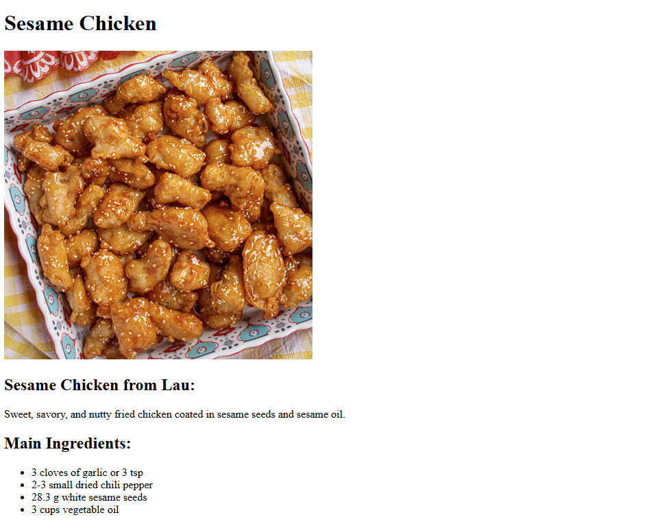

# Recipes

A collection of three recipes - Sesame Chicken, Korean Fried Chicken, and Chocolate Chip Cookies

Built as part of [The Odin Project](https://www.theodinproject.com/) curriculum to practice **basic HTML**, **linking websites**, and **lists + paragraphs**.

## Features
- Index page with easy links to other HTML sites
- Written recipes with ingredients, instructions, and pictures

## Demo
<h3><a href="https://songzhang015.github.io/project-1-recipes/" target="_blank">Live Demo</a><h3>

## Built Using
- HTML
